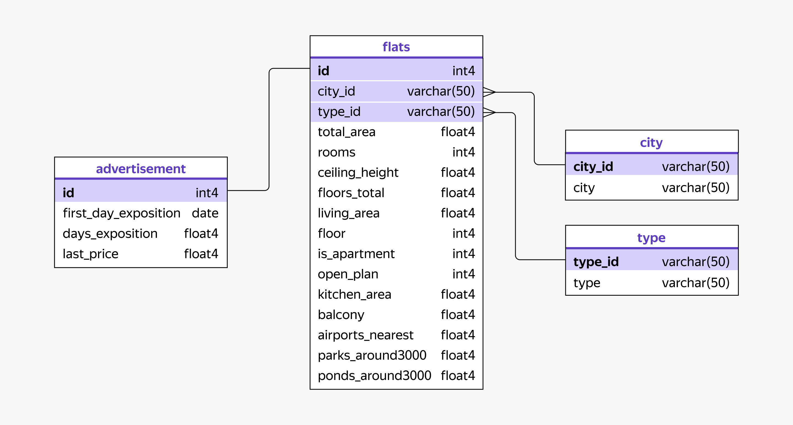

# Аналитика рынка недвижимости Санкт-Петербурга и Ленинградской области

Учебный проект, выполненный в рамках обучения на BI-аналитика. Цель проекта — проанализировать архив объявлений о продаже квартир и построить интерактивный дашборд для отдела аналитики агентства недвижимости.

**Дашборд:** https://datalens.yandex/1g2q8g3e3o7cm

**Стек:** SQL (DBeaver) — для ad hoc анализа и подготовки данных, Yandex DataLens — для визуализации и построения дашборда.

## Содержание

- [Описание проекта](#описание-проекта)
- [Данные](#данные)
- [ER-диаграмма](#er-диаграмма)
- [Выполненные задачи по ТЗ](#выполненные-задачи-по-тз)
- [Результат](#результат)

## Описание проекта

Архив содержит объявления о продаже квартир в Санкт-Петербурге и населённых пунктах Ленинградской области. Важная особенность: Санкт-Петербург и Ленинградская область — два разных субъекта РФ, Санкт-Петербург не входит в состав области.

Населённые пункты в данных различаются по типу — от крупных городов до посёлков и деревень, и рынок недвижимости в каждом типе населённого пункта имеет свою специфику. Поэтому анализ строится с учётом фильтрации по типу населённого пункта.

В данных есть не только дата публикации объявления, но и количество дней, в течение которых оно оставалось активным (`days_exposition`). Если объявление снято с публикации, в рамках проекта это интерпретируется как факт продажи квартиры — прямых данных о сделках в архиве нет, поэтому это допущение является ключевым при интерпретации метрик.

## Данные

Данные организованы в четырёх связанных таблицах.

### `advertisement` — объявления

| Поле | Описание |
|---|---|
| `id` | идентификатор объявления (PK) |
| `first_day_exposition` | дата подачи объявления |
| `days_exposition` | длительность размещения объявления, дней |
| `last_price` | стоимость квартиры в объявлении, руб. |

### `flats` — квартиры

| Поле | Описание |
|---|---|
| `id` | идентификатор квартиры (PK, связан с `advertisement.id`) |
| `city_id` | идентификатор населённого пункта (FK → `city.city_id`) |
| `type_id` | идентификатор типа населённого пункта (FK → `type.type_id`) |
| `total_area` | общая площадь, кв. м |
| `rooms` | число комнат |
| `ceiling_height` | высота потолка, м |
| `floors_total` | этажность дома |
| `living_area` | жилая площадь, кв. м |
| `floor` | этаж квартиры |
| `is_apartment` | признак апартаментов (1/0) |
| `open_plan` | признак открытой планировки (1/0) |
| `kitchen_area` | площадь кухни, кв. м |
| `balcony` | количество балконов |
| `airports_nearest` | расстояние до ближайшего аэропорта, м |
| `parks_around3000` | число парков в радиусе 3 км |
| `ponds_around3000` | число водоёмов в радиусе 3 км |

### `city` — населённые пункты

| Поле | Описание |
|---|---|
| `city_id` | идентификатор населённого пункта (PK) |
| `city` | название населённого пункта |

### `type` — типы населённых пунктов

| Поле | Описание |
|---|---|
| `type_id` | идентификатор типа населённого пункта (PK) |
| `type` | название типа населённого пункта |

## ER-диаграмма

Схема связей между таблицами:

- `advertisement.id` ↔ `flats.id` — один к одному
- `flats.city_id` → `city.city_id` — многие к одному
- `flats.type_id` → `type.type_id` — многие к одному

## Выполненные задачи по ТЗ 

### Вкладка «Аналитика рынка недвижимости»

- [x] Фильтр по типам населённых пунктов — для фокусировки на интересующих сегментах рынка.
- [x] Показатель «Средняя площадь» — для оценки стандартных размеров квартир на рынке.
- [x] Среднее количество дней продажи на одну квартиру — визуализировано диаграммой с областями, симметрично метрикам «Количество квартир» и «Средняя цена квартиры».
- [x] Чарт «Топ-5 по количеству дней продажи» — пять населённых пунктов с минимальным средним значением `days_exposition`, с цветовым выделением по скорости продаж.
- [x] Фильтр детализации по периоду (день / неделя / месяц / год) — для анализа продаж, цен и сроков в динамике.

### Вкладка «Детализация рынка»

- [x] В чарте по населённым пунктам `city_id` заменён на название населённого пункта, колонка переименована.
- [x] Сортировка по средней стоимости квадратного метра (по убыванию), значения раскрашены градиентом: дорогие — красный, средние — жёлтый, дешёвые — зелёный.
- [x] Средняя стоимость квадратного метра по планировке и типу жилья — тип графика заменён с круговой диаграммы на столбчатые диаграммы (корректно для сравнения средних значений).
- [x] Добавлены признаки наличия рядом водоёма и парка, визуализированы столбчатыми диаграммами по аналогии с планировкой и типом жилья.
- [x] Распределение публикаций объявлений по дням недели: самый активный день — зелёным, наименее активный — красным, остальные — жёлтым.
- [x] График сезонности публикаций: линия на каждый год, по оси X — месяцы; помогает увидеть сезонные закономерности и провалы в данных по годам.

## Результат

Готовый интерактивный дашборд с двумя вкладками — «Аналитика рынка недвижимости» и «Детализация рынка» — доступен по ссылке:

**https://datalens.yandex/1g2q8g3e3o7cm**

Дашборд позволяет отделу аналитики агентства недвижимости:
- отслеживать ключевые метрики рынка (количество объявлений, средняя цена, средняя площадь, средний срок продажи) с фильтрацией по типу населённого пункта и периоду;
- сравнивать населённые пункты по скорости продажи квартир;
- анализировать, как на стоимость квадратного метра влияют планировка, тип жилья и наличие рядом парков/водоёмов;
- изучать сезонность и динамику публикации объявлений по дням недели, месяцам и годам.
