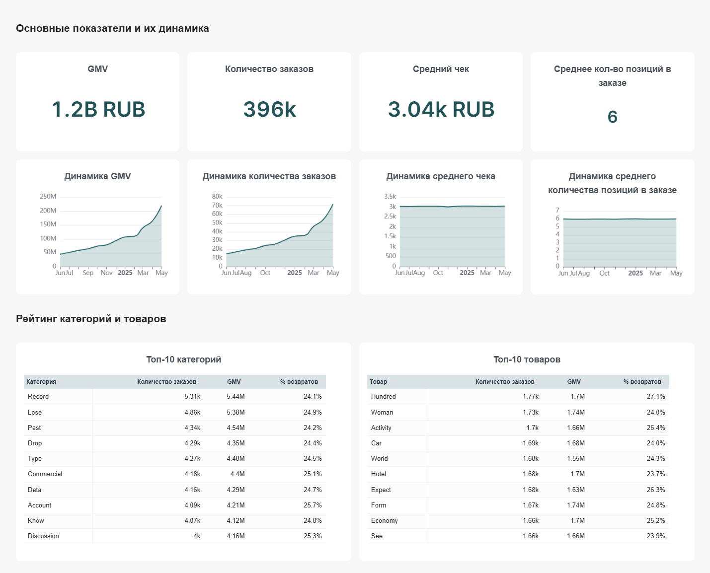
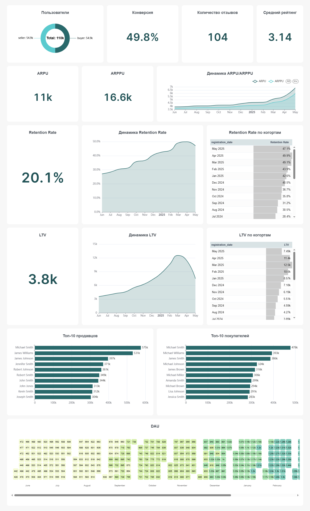

# 📊 Маркетплейс: аналитический дашборд по продажам и пользователям

Аналитический дашборд для отдела маркетплейса, разработанный в **Apache Superset**. Дашборд отслеживает ключевые показатели продаж, юнит-экономики и удержания пользователей, помогая оптимизировать ассортимент и маркетинговые кампании.

## 📌 О проекте

| Параметр | Значение |
|---|---|
| **Автор** | Андрей Панов, BI-аналитик |
| **Дата создания** | 25.08.2026 |
| **Заказчик** | Руководитель отдела маркетплейса |
| **Целевая аудитория** | Команда маркетинга, аналитика, продуктовые менеджеры, руководители направлений |

**Бизнес-цель:** отслеживание ключевых показателей для повышения эффективности продаж, оптимизации ассортимента и удержания пользователей.

### Задачи дашборда
- Оценка финансовых показателей и объёма продаж (GMV, количество заказов, средний чек) для понимания масштабов роста маркетплейса
- Анализ юнит-экономики и монетизации аудитории через метрики ARPU, ARPPU и LTV
- Мониторинг удержания пользователей (Retention Rate) в динамике и по когортам
- Выявление наиболее успешных категорий и товаров (Топ-10) для оптимизации складских запасов и маркетинговых кампаний
- Анализ активности покупателей и продавцов (соотношение сторон, DAU, рейтинг, отзывы)

## 🛠 Стек технологий

- **Apache Superset** — визуализация и построение дашборда
- **Jupyter Notebook** — обработка и очистка исходных данных из CSV-файла, использование библиотек `pandas`, `matplotlib`, `seaborn` для проведения исследовательского анализа
- **SQL** — расчёт метрик (GMV, конверсия, ARPU/ARPPU, Retention Rate, LTV и др.)

### Схема данных
Дашборд строится на четырёх таблицах:
- `marketplace.orders` — заказы
- `marketplace.order_items` — позиции в заказах
- `marketplace.users` — пользователи (покупатели и продавцы)
- `marketplace.reviews` — отзывы и рейтинги

## 📁 Структура репозитория

```
├── README.md
├── docs/
│   ├── dashboard-documentation.docx     # документация на дашборд: метрики, источники, формулы
│   └── user-guide.docx                  # инструкция для пользователей дашборда
└── screenshots/
    ├── sales-analysis.jpg               # вкладка "Анализ продаж"
    └── users-analysis.jpg               # вкладка "Анализ пользователей"
```

## 📈 Вкладка «Анализ продаж»



- **Основные показатели:** GMV, количество заказов, средний чек, среднее количество позиций в заказе
- **Динамика показателей** по месяцам — помогает выявлять сезонность и планировать складские мощности
- **Топ-10 категорий и товаров** — лидеры по выручке и числу заказов с указанием % возвратов, для перераспределения маркетингового бюджета и ротации проблемного ассортимента

## 👥 Вкладка «Анализ пользователей»



- **Пользователи:** соотношение покупателей и продавцов на платформе
- **Основные показатели:** конверсия, количество отзывов, средний рейтинг
- **ARPU / ARPPU:** средний доход на пользователя и на платящего пользователя, динамика по месяцам
- **Retention Rate:** удержание клиентов — среднее значение, динамика и когортный анализ
- **LTV:** ценность клиента — среднее значение, динамика и когортный анализ
- **Топ-10 продавцов и покупателей** по вкладу в GMV
- **DAU:** тепловая карта ежедневной активности покупателей — помогает определить лучшие дни для рассылок и акций

## 🧮 Ключевые метрики

| Метрика | Логика расчёта | Источник |
|---|---|---|
| GMV | `SUM(total_amount)` | orders |
| Количество заказов | `COUNT(DISTINCT order_id)` | orders |
| Средний чек | `SUM(total_amount) / COUNT(order_id)` | orders |
| Конверсия | `COUNT(DISTINCT buyer_id) / COUNT(DISTINCT user_id)` | users + orders |
| Retention Rate | доля пользователей с повторным заказом после первого месяца | users + orders |
| ARPU | выручка / число активных пользователей | orders |
| ARPPU | выручка / число платящих пользователей | orders |
| LTV | выручка за 3 месяца / число пользователей когорты | users + orders |
| DAU | `COUNT(DISTINCT buyer_id)` по дням | orders |

Полная таблица метрик, включая расчёт среднего рейтинга и количества отзывов, приведена в [документации на дашборд](docs/dashboard-documentation.docx).

## 🔎 Фильтры

| Фильтр | Описание |
|---|---|
| **Период** | интервал дат, по умолчанию 01.06.2024 – 31.05.2025 |
| **Категория товара** | множественный выбор товарных категорий |
| **Статус заказа** | выполнен / отменён / в обработке / возврат — для анализа воронки продаж |
| **Рейтинг** | фильтрация по оценкам 1–5 звёзд — для выделения проблемных товаров/продавцов |

## 💡 Примеры инсайтов и сигналов, которые отслеживает дашборд

- **Рост заказов при падении GMV** → сигнал о смещении спроса в сторону дешёвых товаров или агрессивных скидках
- **Просадка Retention Rate в новых когортах** → ухудшение качества привлекаемого трафика или технические проблемы
- **Рост % возвратов в топ-товарах выше 25%** → некачественное описание карточки или брак в партии
- **Аномальный спад DAU** → технические сбои платформы или проблемы с оплатой/авторизацией

Связка метрик «GMV + Средний чек + DAU» позволяет отличить рост за счёт расширения аудитории от роста за счёт перехода в премиум-сегмент, а связка «Категории + Отзывы + Возвраты» помогает быстро найти причину падения выручки в конкретной категории.

## 📄 Документация

- [`docs/dashboard-documentation.docx`](docs/dashboard-documentation.docx) — полная техническая документация: метрики, формулы, источники данных, визуализации
- [`docs/user-guide.docx`](docs/user-guide.docx) — инструкция для конечных пользователей дашборда: работа с фильтрами, интерпретация метрик и графиков

## 🎓 О проекте

Дашборд разработан в рамках учебного проекта по BI-аналитике. Исходные данные (CSV) были предварительно обработаны и структурированы в Jupyter Notebook, после чего загружены в базу данных и подключены к Superset для построения визуализаций.
